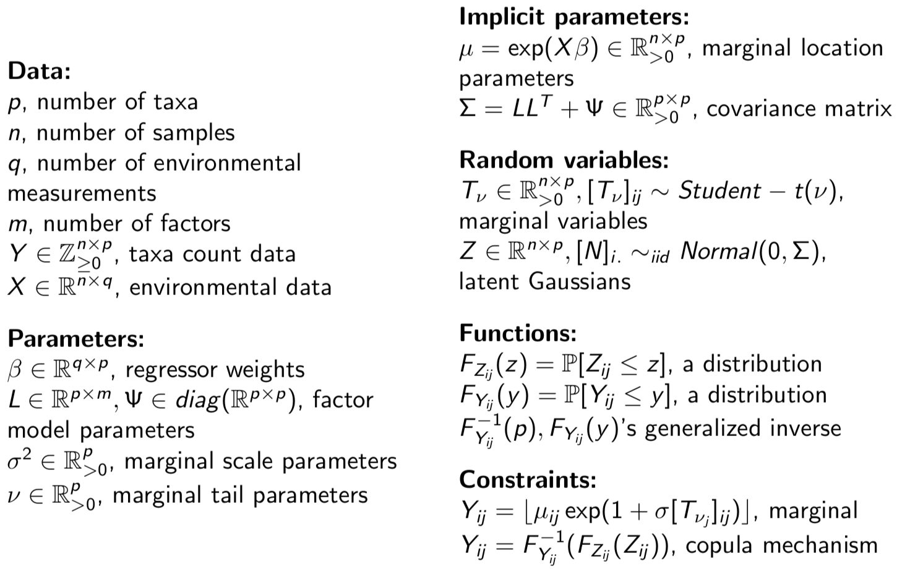

More information on this model is provided at [wdurno.squarespace.com/model-implementation](https://wdurno.squarespace.com/model-implementation). The best description is in my thesis (net yet published). A terse description of the model follows. Notice that it is a multi-variate count data regression software. Count distributions are given multivariate dependency through Gaussian copula. In order to avoid over-fit, the covariance structure is approximated with a factor-analysis model. 

